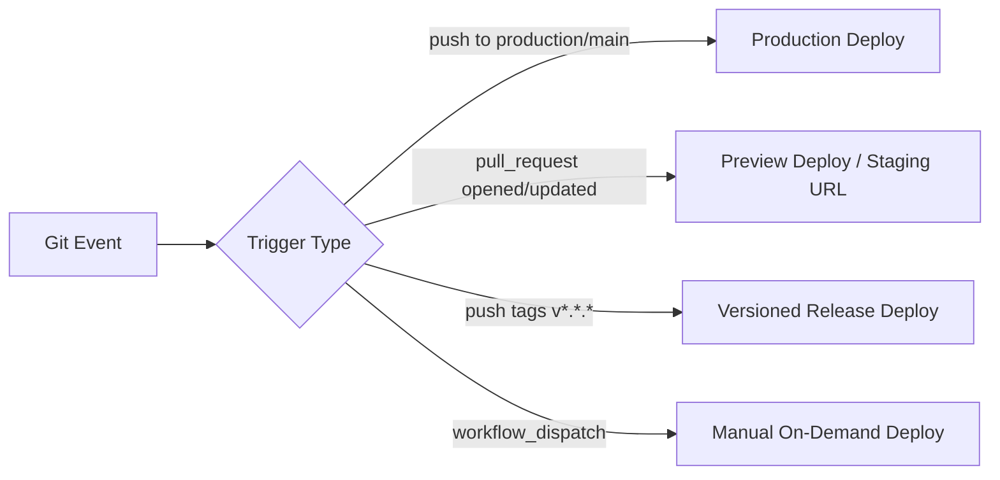

# Deployment Guide — fzl-fund-appshell--lit

This document explains the events that trigger deployments, the available 100% free hosting targets, and step-by-step instructions for configuring CI/CD pipelines in any new project using this appshell.

---

## 1. What Triggers a Deployment?

In modern CI/CD pipelines, deployments are automated through **Git events**. The most common triggers are:



### Main Trigger Types

1. **Push to Production Branch (`push: branches: [production]` or `[main]`)**
   - **When:** Automatically runs when commits are pushed or merged into the production branch.
   - **Action:** Runs tests, compiles the production bundle with Vite (`npm run build`), and publishes the `dist/` directory to the live production environment.

2. **Pull Request (`pull_request: branches: [main]`)**
   - **When:** A developer opens or updates a Pull Request.
   - **Action:** Generates a temporary **Preview Deployment** (supported out-of-the-box by Cloudflare Pages). Reviewers can test the live PWA before approving and merging.

3. **Manual Trigger (`workflow_dispatch`)**
   - **When:** A developer manually clicks **"Run workflow"** in GitHub Actions or runs `gh workflow run deploy.yml`.
   - **Action:** Re-builds and deploys on demand without requiring code changes.

4. **Git Tag / Release (`push: tags: ['v*']`)**
   - **When:** A new semantic version tag is pushed (e.g., `git tag v1.0.0 && git push origin v1.0.0`).
   - **Action:** Triggers a formal versioned deployment matching the release version.

---

## 2. Recommended Branching Strategy

The standard convention across the `fzlbpms-funds` family is:

* **`main`**: Active development branch. Feature branches and PRs merge here.
* **`production`**: Live production deployment branch. When features in `main` are tested and ready, merge `main` into `production` to trigger the production deploy.
* *(Alternative)*: For smaller projects, you can use trunk-based development and deploy directly on every push to `main`.

---

## 3. Pre-Deploy Configuration: Variables & Environment

Since the appshell is compiled ahead of time by Vite into static files, all variables starting with `VITE_*` (like GA4 Measurement ID, REST endpoints, and App Title) are baked into the build at compile-time.

### Managing Variables in GitHub Actions

Set your variables under **Settings → Secrets and variables → Actions → Variables**:

| Variable Name | Example Value | Description |
| :--- | :--- | :--- |
| `VITE_GA4_MEASUREMENT_ID` | `G-XXXXXXXXXX` | Google Analytics 4 Measurement ID |
| `VITE_REST_SERVICES_BASE_PATH` | `https://api.example.com/v1` | Base URL for backend REST API |

> [!TIP]
> You can verify and set variables directly from your terminal using the helper scripts included in the appshell:
> ```bash
> # Check configured variables in GitHub
> npx appshell-list-gh-variables
> 
> # Interactively set and validate GA4 Measurement ID
> npx appshell-set-ga4-variable
> ```

---

## 4. Deployment Targets & Pipelines

The appshell produces a **100% static bundle** in `dist/` with client-side hash routing (`#/`). Below are step-by-step instructions for the top **100% completely free** hosting platforms.

---

### Option A: GitHub Pages (Default & Zero Infra)

GitHub Pages hosts your static PWA directly from your GitHub repository for free.

#### 1. Configure GitHub Repository
1. Go to **Settings → Pages**.
2. Under **Build and deployment → Source**, select **GitHub Actions**.

#### 2. Create Workflow File
Create `.github/workflows/deploy.yml` in your consumer project:

```yaml
name: Deploy to GitHub Pages

on:
  push:
    branches:
      - production  # or 'main' if deploying directly from main
  workflow_dispatch:

permissions:
  contents: read
  pages: write
  id-token: write

concurrency:
  group: 'pages'
  cancel-in-progress: true

jobs:
  build-and-deploy:
    environment:
      name: github-pages
      url: ${{ steps.deployment.outputs.page_url }}
    runs-on: ubuntu-latest
    steps:
      - name: Checkout repository (with submodules)
        uses: actions/checkout@v4
        with:
          submodules: recursive
          fetch-depth: 0

      - name: Setup Node.js
        uses: actions/setup-node@v4
        with:
          node-version: 20
          cache: 'npm'

      - name: Install dependencies
        run: npm ci

      - name: Run test suite
        run: npm test

      - name: Build static PWA
        env:
          VITE_GA4_MEASUREMENT_ID: ${{ vars.VITE_GA4_MEASUREMENT_ID }}
          VITE_REST_SERVICES_BASE_PATH: ${{ vars.VITE_REST_SERVICES_BASE_PATH }}
        run: npm run build

      - name: Upload artifact for GitHub Pages
        uses: actions/upload-pages-artifact@v3
        with:
          path: './dist'

      - name: Deploy to GitHub Pages
        id: deployment
        uses: actions/deploy-pages@v4
```

---

### Option B: Cloudflare Pages (Fastest CDN & Unlimited Bandwidth)

Cloudflare Pages provides global edge distribution, unlimited free bandwidth, instant custom domains with SSL, and automatic branch preview URLs.

#### Method 1: Direct Git Integration (Zero YAML required)
1. Log into the [Cloudflare Dashboard](https://dash.cloudflare.com/) and go to **Workers & Pages → Create Application → Pages → Connect to Git**.
2. Select your repository.
3. Configure build settings:
   - **Framework preset:** `None` (or `Vite`)
   - **Build command:** `npm run build`
   - **Build output directory:** `dist`
   - **Root directory:** `/`
4. Add Environment Variables (e.g. `VITE_GA4_MEASUREMENT_ID`).
5. Click **Save and Deploy**. Cloudflare will automatically build on every `push` and generate preview links on every `pull_request`.

#### Method 2: Via GitHub Actions (`wrangler-action`)
Create `.github/workflows/deploy-cloudflare.yml`:

```yaml
name: Deploy to Cloudflare Pages

on:
  push:
    branches: [production, main]
  pull_request:
  workflow_dispatch:

jobs:
  deploy:
    runs-on: ubuntu-latest
    steps:
      - name: Checkout
        uses: actions/checkout@v4
        with:
          submodules: recursive

      - name: Setup Node
        uses: actions/setup-node@v4
        with:
          node-version: 20
          cache: 'npm'

      - name: Install & Build
        run: |
          npm ci
          npm run build
        env:
          VITE_GA4_MEASUREMENT_ID: ${{ vars.VITE_GA4_MEASUREMENT_ID }}

      - name: Deploy to Cloudflare Pages
        uses: cloudflare/wrangler-action@v3
        with:
          apiToken: ${{ secrets.CLOUDFLARE_API_TOKEN }}
          accountId: ${{ secrets.CLOUDFLARE_ACCOUNT_ID }}
          command: pages deploy dist --project-name=my-app-name
```

---

### Option C: GitLab Pages

For repositories hosted on GitLab, create `.gitlab-ci.yml` in the project root:

```yaml
image: node:20-alpine

stages:
  - test
  - build
  - deploy

variables:
  GIT_SUBMODULE_STRATEGY: recursive

test:
  stage: test
  script:
    - npm ci
    - npm test

pages:
  stage: deploy
  script:
    - npm ci
    - npm run build
    - mv dist public
  artifacts:
    paths:
      - public
  rules:
    - if: $CI_COMMIT_BRANCH == "production" || $CI_COMMIT_BRANCH == "main"
```

---

### Option D: Self-Hosted Container (Docker + Caddy / Nginx)

For self-hosted deployments (VPS, Coolify, CapRover, or On-Premise):

#### Multi-stage `Dockerfile`:
```dockerfile
# Build Stage
FROM node:20-alpine AS builder
WORKDIR /app
COPY package*.json ./
RUN npm ci
COPY . .
RUN npm run build

# Web Server Stage (Caddy with automatic SSL)
FROM caddy:alpine
COPY --from=builder /app/dist /usr/share/caddy
EXPOSE 80 443
```

#### Cache Optimization (Caddyfile):
```caddy
:80 {
    root * /usr/share/caddy
    file_server

    # Never cache service worker or root HTML to allow instant PWA updates
    @nocache path /sw.js /index.html /manifest.webmanifest
    header @nocache Cache-Control "no-cache, no-store, must-revalidate"

    # Cache immutable hashed assets for 1 year
    @immutable path /assets/*
    header @immutable Cache-Control "public, max-age=31536000, immutable"
}
```

---

## 5. Post-Deployment Verification Checklist

After deploying a new application built with the appshell, verify:

- [ ] **Base Path**: The application loads cleanly at `https://<domain>/<base>/` without 404s on assets.
- [ ] **Hash Navigation**: Navigating to `#/` and sub-routes loads without full page refreshes.
- [ ] **Service Worker Registration**: DevTools → Application → Service Workers shows status `Activated and running`.
- [ ] **Offline Functionality**: In DevTools Network tab, toggle **Offline** and refresh the page. The app must load immediately.
- [ ] **Isolated Storage**: In DevTools Application → LocalStorage, all keys are prefixed with `app-name:` and do not conflict with sibling apps.
- [ ] **Consent & Telemetry**: If GA4 is configured, the `<consent-banner>` appears on first load and no analytics cookies are created before accepting.
